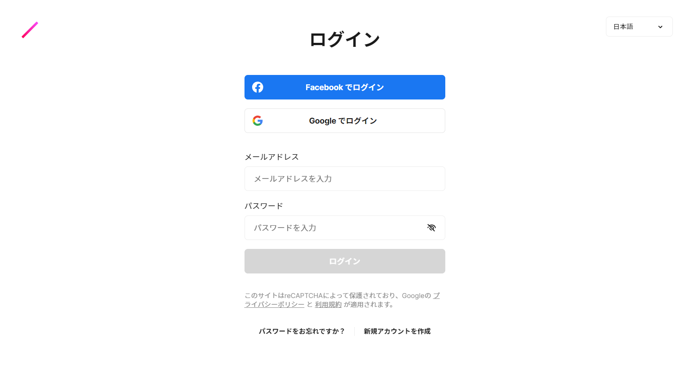
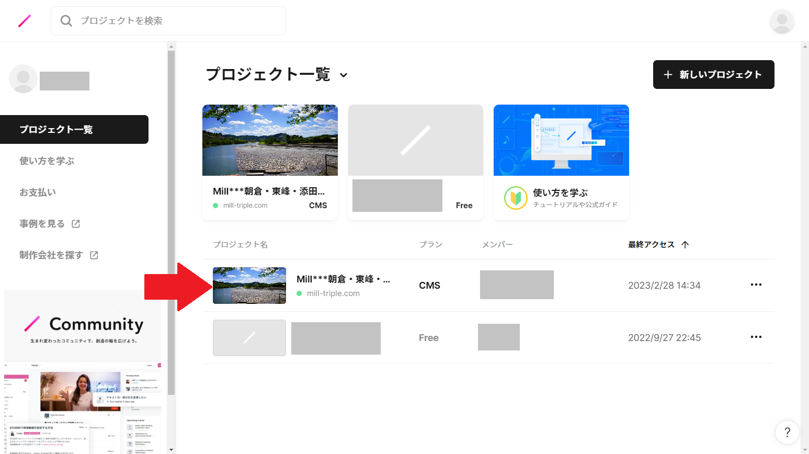
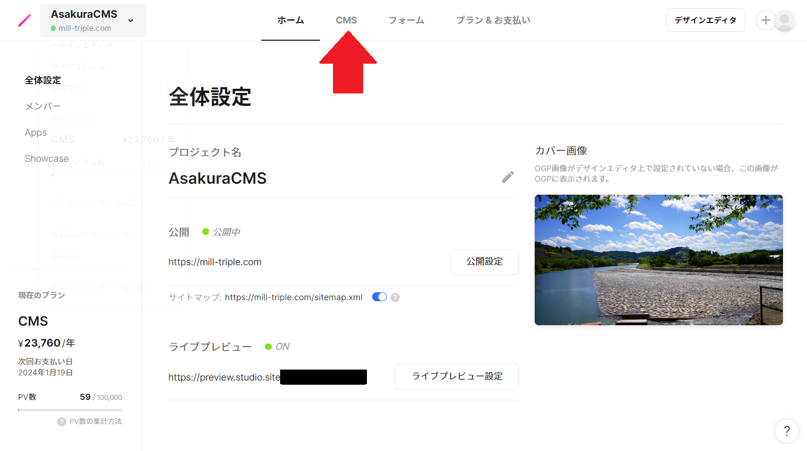
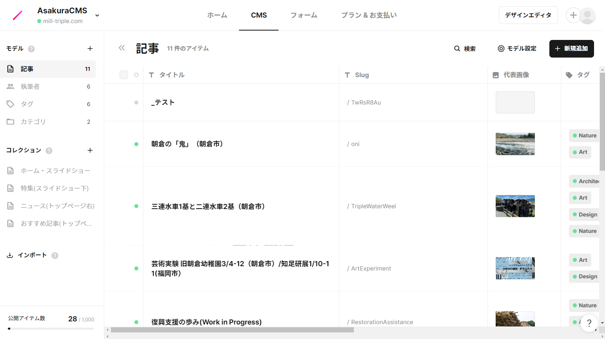
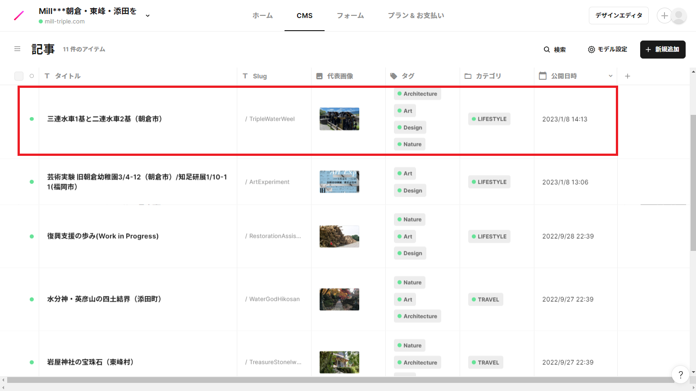
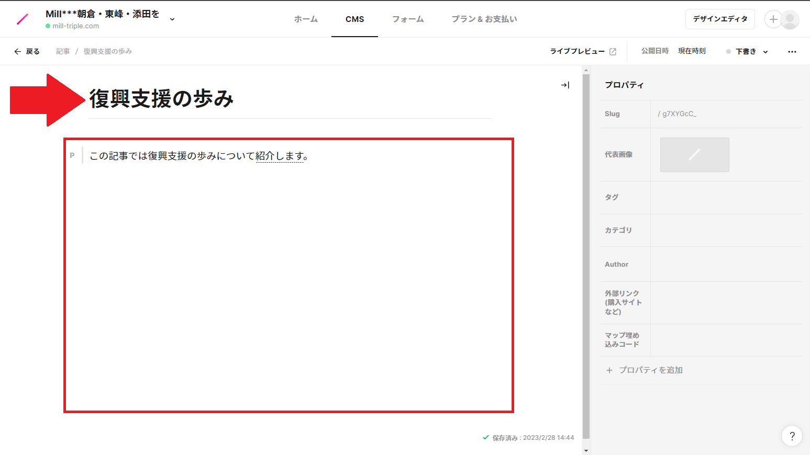
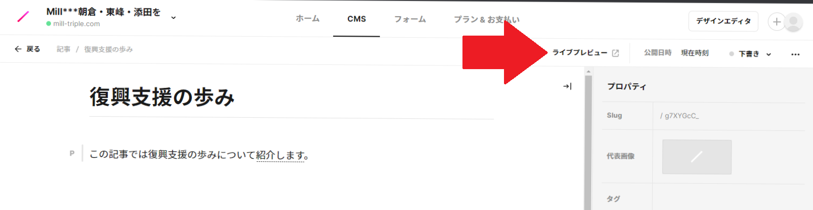
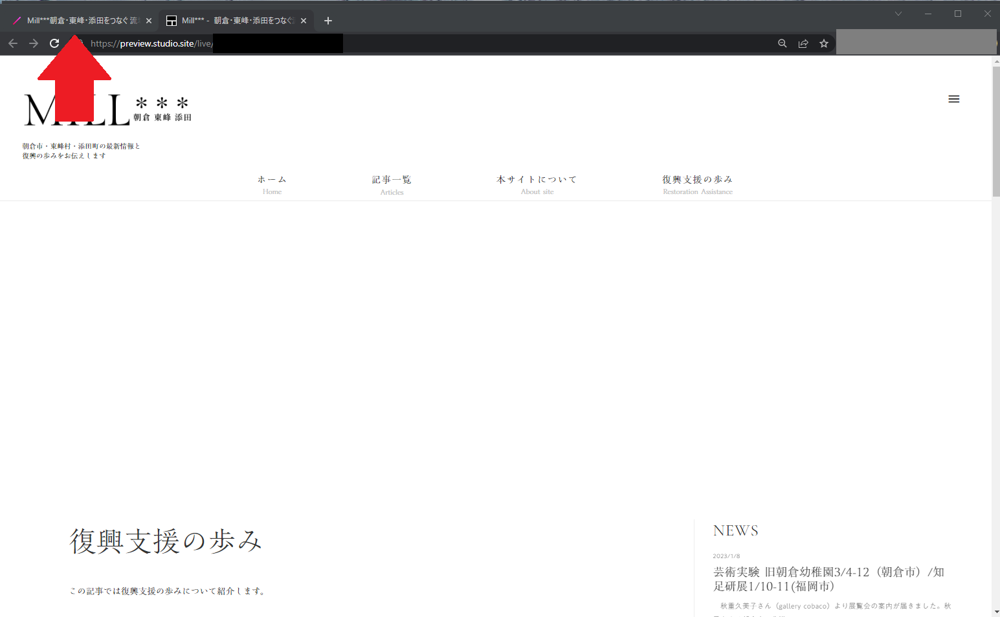
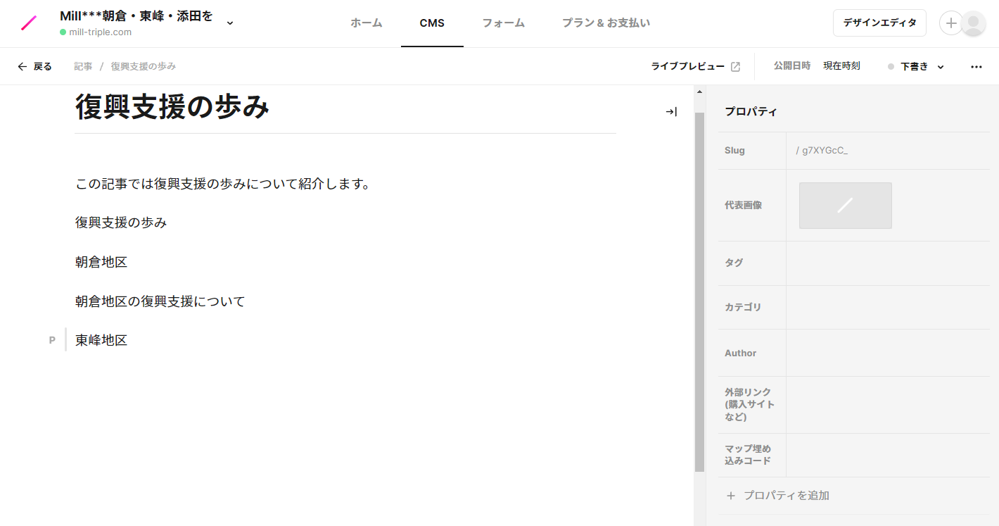
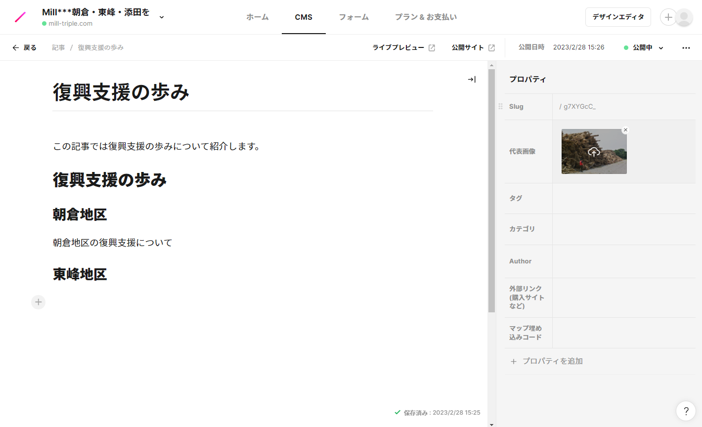

# MILL*** 記事執筆の手引き

このページでは、記事の執筆方法について
- Studioへのログイン
- 新規記事の作成
- ライブプレビューの利用
- 本文の装飾
- 代表画像の設定
- 記事の公開

の順に説明します

___

## Studioへのログイン
1. まず、[https://app.studio.design/](https://app.studio.design/) にアクセスしてください。このページが表示される場合、メールアドレスとパスワードを入力のうえ、ログインボタンを押してください。

## 新規記事の作成
1. ログイン後、プロジェクトのページにアクセスします

1. CMSボタンを押します

1. このように記事一覧が表示されます

1. 一つ一つが記事になっています。赤い四角で囲まれた部分が一つの記事です

1. それでは、新しい記事を作成しましょう。右上の「+新規追加」から新しい記事を作成できます

1. 矢印の部分には記事のタイトルを、四角で囲まれた部分には記事本文を書きます

## ライブプレビューの利用
1. 記事を書いている時には、実際のサイトでどのように見えるのか確認しながら書きましょう。そのために、「ライブプレビュー」が利用できます
1. 右上の「ライブプレビュー」を押します

1. 新しいページでどのように見えるかが表示されます。真っ白なのはまだ画像を設定していないためです。なお、編集ページに戻るには、矢印のように隣のタブを押します(見え方は、多少異なることがあります)

## 本文の装飾
1. 編集ページに戻り、記事を執筆します

1. 記事本文には、見出しをなどを設定することができます。見出しは、雑誌や新聞と同じく、記事を分かりやすくするものです。選択中の文章の左側に現れる「P」などのボタンから設定することができます

1. また、画像を追加することもできます。新しい行に表示される「+」ボタンから、画像を選択しましょう

## 代表画像の設定
1. 記事には代表画像を設定することもできます。画像があると目を引く記事になるので、ぜひ設定しましょう
1. 使用する画像をコンピューター内に保存しておきます
1. 矢印の部分を押し、コンピューターに入っている画像から選択します

## 記事の公開
1. 記事が出来上がったら、もう一度ライブプレビューを見て問題ないかを確認します
1. 確認したら、右上の「下書き」ボタンから「公開する」を選択します

1. 「公開中」になればOKです！
